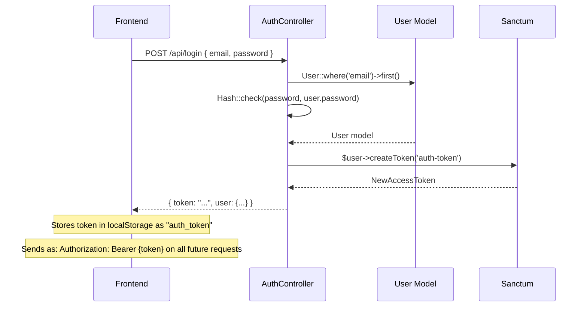
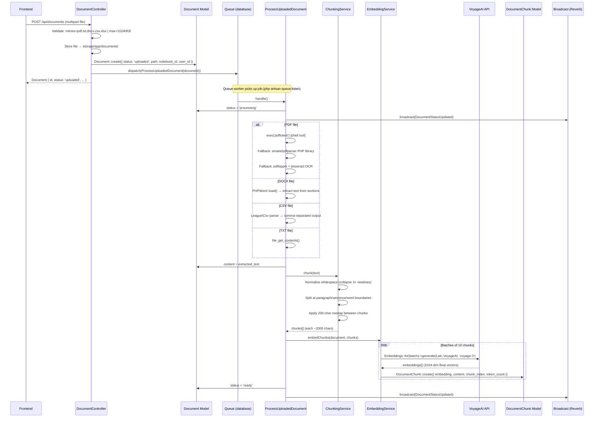

# Backend Architecture & AI Flow Documentation

> Laravel NotebookLLM — complete backend reference covering folder structure, API endpoints, AI request flows, Laravel AI SDK integration, and service internals.

---

## Table of Contents

1. [Project Overview](#1-project-overview)
2. [Folder Structure](#2-folder-structure)
3. [API Endpoints](#3-api-endpoints)
4. [Request Flow Diagrams](#4-request-flow-diagrams)
   - [Authentication Flow](#41-authentication-flow)
   - [Document Upload & Processing](#42-document-upload--processing-pipeline)
   - [Non-Streaming RAG Chat](#43-non-streaming-rag-chat)
   - [SSE Streaming Chat](#44-sse-streaming-chat)
   - [Audio Overview Generation](#45-audio-overview-generation)
   - [Content Generation](#46-content-generation)
5. [Laravel AI SDK Deep Dive](#5-laravel-ai-sdk-deep-dive)
6. [KnowledgeAgent Internals](#6-knowledgeagent-internals)
7. [Services](#7-services)
8. [Jobs (Async Pipelines)](#8-jobs-async-pipelines)
9. [Models & Relationships](#9-models--relationships)
10. [Middleware](#10-middleware)
11. [Configuration](#11-configuration)
12. [Environment Variables](#12-environment-variables)

---

## 1. Project Overview

| Layer | Technology |
|---|---|
| Framework | Laravel 12 |
| Language | PHP 8.2+ |
| Authentication | Laravel Sanctum (token-based) |
| AI SDK | `laravel/ai ^0.2.5` |
| LLM Provider | Groq — `llama-3.3-70b-versatile` |
| Embeddings | VoyageAI — `voyage-3` (1024-dim vectors) |
| Images | Google Gemini (default) |
| Audio Transcription | OpenAI Whisper |
| Vector Search | `orderByVectorDistance()` — pgvector or SQLite extension |
| Queue | Database-backed (`jobs` table) |
| PDF Parsing | `smalot/pdfparser` + `pdftotext` + OCR fallback |
| Realtime | Laravel Reverb (WebSocket broadcasts) |
| Monitoring | Laravel Nightwatch |

### Core Concept: RAG (Retrieval-Augmented Generation)

The system implements RAG to answer user questions grounded in uploaded documents:
1. Documents are chunked and embedded as 1024-dim vectors at upload time
2. At chat time, the user query is embedded and the top-5 most similar chunks are retrieved
3. Those chunks are injected into the Groq system prompt as context
4. Groq generates a response grounded in that context, with source citations returned to the frontend

---

## 2. Folder Structure

```
backend/
│
├── app/
│   │
│   ├── Ai/
│   │   └── Agents/
│   │       └── KnowledgeAgent.php         # Core RAG agent. Implements Agent + Promptable.
│   │                                      # Handles chat, streaming, content generation,
│   │                                      # and vector context retrieval.
│   │
│   ├── Http/
│   │   ├── Controllers/
│   │   │   ├── AuthController.php         # register(), login(), logout()
│   │   │   ├── ChatController.php         # chat(), stream(), suggestQuestions(), history()
│   │   │   ├── DocumentController.php     # index(), store() upload, storeUrl(), destroy()
│   │   │   ├── NotebookController.php     # Full CRUD for user notebooks
│   │   │   ├── NoteController.php         # Notes attached to notebooks / chat messages
│   │   │   ├── UserController.php         # Profile update, password change, usage stats
│   │   │   ├── ImageController.php        # generate() — Gemini image generation
│   │   │   ├── AudioController.php        # transcribe() — OpenAI Whisper
│   │   │   ├── AudioOverviewController.php# show(), generate(), stream() podcast scripts
│   │   │   └── ContentGenerationController.php  # generate() — study guide, FAQ, timeline, briefing
│   │   │
│   │   └── Middleware/
│   │       ├── StreamAuth.php             # Token auth via ?token= query param (EventSource)
│   │       └── ApiAuth.php               # Alternative Sanctum auth check returning 401 JSON
│   │
│   ├── Jobs/
│   │   ├── ProcessUploadedDocument.php    # Async: extract text → chunk → embed → status=ready
│   │   └── GenerateAudioOverview.php      # Async: context → Groq script → duration calc
│   │
│   ├── Models/
│   │   ├── User.php                       # HasMany: notebooks, documents, notes, aiUsageLogs
│   │   ├── Notebook.php                   # HasMany: documents, chatMessages, notes; HasOne: audioOverview
│   │   ├── Document.php                   # HasMany: chunks; status: uploaded→processing→ready/failed
│   │   ├── DocumentChunk.php              # embedding (1024-dim array), content, chunk_index
│   │   ├── ChatMessage.php                # role (user/assistant), content, metadata (sources)
│   │   ├── Note.php                       # pinned, title, content; optional chatMessage reference
│   │   ├── AiUsageLog.php                 # provider, model, operation, tokens, estimated_cost
│   │   └── AudioOverview.php              # status, script, duration_seconds, storage_path
│   │
│   └── Services/
│       ├── EmbeddingService.php           # VoyageAI embed/search. embedChunks(), searchSimilarChunks()
│       ├── ChunkingService.php            # 2000 char / 200 overlap text splitter with smart breaks
│       └── BusinessEventLogger.php        # Structured log helper. Logs to Nightwatch + ai_events file
│
├── config/
│   ├── ai.php                             # 13 AI providers; defaults for images/audio/embeddings
│   ├── queue.php                          # Database queue, retry_after=90s
│   ├── sanctum.php                        # Stateful domains, token prefix, expiry=null
│   └── broadcasting.php                  # Reverb WebSocket config
│
└── routes/
    └── api.php                            # All 25+ API endpoints with middleware grouping
```

---

## 3. API Endpoints

### Public (No Auth)

| Method | Path | Controller | Description |
|---|---|---|---|
| POST | `/api/register` | AuthController::register | Create account, returns Sanctum token |
| POST | `/api/login` | AuthController::login | Returns Sanctum token |

### Protected — Sanctum Token (`auth:sanctum`)

| Method | Path | Controller | Description |
|---|---|---|---|
| GET | `/api/user` | inline | Returns authenticated user |
| POST | `/api/logout` | AuthController::logout | Revokes current token |
| PATCH | `/api/user` | UserController::update | Update name/email |
| PUT | `/api/user/password` | UserController::updatePassword | Change password |
| DELETE | `/api/user` | UserController::destroy | Delete account |
| GET | `/api/usage` | UserController::usage | AI usage aggregated by provider/model/month |
| GET | `/api/notebooks` | NotebookController::index | List user's notebooks |
| POST | `/api/notebooks` | NotebookController::store | Create notebook |
| GET | `/api/notebooks/{notebook}` | NotebookController::show | Get notebook |
| PATCH | `/api/notebooks/{notebook}` | NotebookController::update | Update notebook |
| DELETE | `/api/notebooks/{notebook}` | NotebookController::destroy | Delete notebook |
| GET | `/api/documents` | DocumentController::index | List documents (optional ?notebook_id=) |
| POST | `/api/documents` | DocumentController::store | Upload file (pdf/txt/docx/csv/xlsx, max 10MB) |
| POST | `/api/documents/url` | DocumentController::storeUrl | Fetch URL, extract text, store as document |
| DELETE | `/api/documents/{document}` | DocumentController::destroy | Delete document |
| POST | `/api/chat` | ChatController::chat | Non-streaming RAG chat |
| GET | `/api/chat/history/{notebookId}` | ChatController::history | Last 50 messages, oldest first |
| POST | `/api/chat/suggest-questions` | ChatController::suggestQuestions | 3 AI-generated follow-up questions |
| GET | `/api/notebooks/{notebookId}/notes` | NoteController::index | List notes (pinned first) |
| POST | `/api/notes` | NoteController::store | Create note |
| PATCH | `/api/notes/{note}` | NoteController::update | Update note |
| DELETE | `/api/notes/{note}` | NoteController::destroy | Delete note |
| GET | `/api/notebooks/{notebookId}/audio-overview` | AudioOverviewController::show | Get audio overview |
| POST | `/api/notebooks/{notebookId}/audio-overview` | AudioOverviewController::generate | Trigger generation |
| POST | `/api/notebooks/{notebookId}/generate-content` | ContentGenerationController::generate | Generate study_guide/faq/timeline/briefing |
| POST | `/api/images/generate` | ImageController::generate | Generate image from prompt |
| POST | `/api/audio/transcribe` | AudioController::transcribe | Transcribe audio file |
| POST | `/api/broadcasting/auth` | Broadcast::auth | Laravel Reverb channel auth |

### Protected — Stream Auth (`stream.auth` middleware)

| Method | Path | Controller | Description |
|---|---|---|---|
| GET/POST | `/api/chat/stream` | ChatController::stream | SSE streaming RAG chat (`?token=...&message=...`) |
| GET | `/api/notebooks/{notebookId}/audio-overview/stream` | AudioOverviewController::stream | Stream audio file |

---

## 4. Request Flow Diagrams

### 4.1 Authentication Flow



---

### 4.2 Document Upload & Processing Pipeline

Two-phase flow: synchronous upload response + asynchronous background processing.



---

### 4.3 Non-Streaming RAG Chat

```mermaid
sequenceDiagram
    participant FE as Frontend
    participant CC as ChatController
    participant KA as KnowledgeAgent
    participant ES as EmbeddingService
    participant VA as VoyageAI API
    participant DQ as DocumentChunk Query
    participant GR as Groq API
    participant UL as AiUsageLog
    participant CM as ChatMessage Model

    FE->>CC: POST /api/chat { notebook_id, message }
    CC->>CC: Validate: notebook_id required, message max 4000 chars
    CC->>KA: new KnowledgeAgent(user, notebookId)
    CC->>KA: chat(message)

    KA->>ES: searchSimilarChunks(message, notebookId, limit=5)
    ES->>VA: Embeddings::for([message])->generate(Lab::VoyageAI, 'voyage-3')
    VA-->>ES: queryEmbedding[1024]
    ES->>DQ: DocumentChunk::join(documents)
                 .where(notebook_id)
                 .orderByVectorDistance('embedding', queryEmbedding)
                 .limit(5)
    DQ-->>ES: Collection<DocumentChunk + document_title>
    ES-->>KA: context string + sources[]

    KA->>KA: instructions() injects context into system prompt:
              "DOCUMENT CONTEXT:\n{chunk1}\n{chunk2}..."

    KA->>GR: $this->prompt(message, provider: Lab::Groq, model: 'llama-3.3-70b-versatile')
    GR-->>KA: full text response (TextResponse)

    KA->>UL: AiUsageLog::create({ provider:'groq', model:'llama-3.3-70b-versatile',
                                    operation:'chat', prompt_tokens: len/4,
                                    completion_tokens: len/4, metadata:{notebook_id} })
    KA-->>CC: object{ content(): string, sources: array }

    CC->>CM: ChatMessage::create({ role:'user', content: message })
    CC->>CM: ChatMessage::create({ role:'assistant', content: answer,
                                    metadata: { sources:[...] } })
    CC-->>FE: { answer: "...", sources: [{ title, document_id }] }
```

---

### 4.4 SSE Streaming Chat

EventSource cannot send custom headers, so the token is passed as a query parameter and handled by `StreamAuth` middleware.

```mermaid
sequenceDiagram
    participant FE as Frontend (EventSource)
    participant MW as StreamAuth Middleware
    participant PAT as PersonalAccessToken
    participant CC as ChatController
    participant KA as KnowledgeAgent
    participant ES as EmbeddingService
    participant VA as VoyageAI API
    participant GR as Groq API
    participant CM as ChatMessage Model

    FE->>MW: GET /api/chat/stream?token=xyz&message=Hello&notebook_id=1
    MW->>MW: Check request->user() — not set (EventSource, no header)
    MW->>PAT: PersonalAccessToken::findToken('xyz')
    PAT-->>MW: AccessToken record
    MW->>MW: auth()->setUser(accessToken->tokenable)
    MW->>CC: stream() — authenticated

    CC->>CC: Validate message + notebook_id
    CC->>KA: new KnowledgeAgent(user, notebookId)

    CC->>KA: retrieveContext(message)
    KA->>ES: searchSimilarChunks(message, notebookId, 5)
    ES->>VA: embed query
    VA-->>ES: queryEmbedding
    ES->>ES: vector distance search → top 5 chunks
    ES-->>KA: context populated, $sources[] set

    CC->>CC: return new StreamedResponse(function() { ... })
    Note over CC: Headers: Content-Type: text/event-stream
                            Cache-Control: no-cache, no-transform
                            X-Accel-Buffering: no

    CC->>KA: chatStream(message)
    KA->>GR: $this->stream(message, Lab::Groq, 'llama-3.3-70b-versatile')

    loop Streaming chunks
        GR-->>KA: TextDelta event (chunk of text)
        KA-->>CC: yield object{ text(): "chunk" }
        CC-->>FE: data: {"delta":"chunk text"}\n\n
        FE->>FE: Append to displayed message
    end

    GR-->>KA: stream complete → returns full text + sources
    CC-->>FE: data: {"sources":[{"title":"Doc A","document_id":1}]}\n\n
    CC-->>FE: data: {"done":true}\n\n

    CC->>CM: ChatMessage::create({ role:'user', content: message })
    CC->>CM: ChatMessage::create({ role:'assistant', content: fullText,
                                    metadata: { sources:[...] } })
```

---

### 4.5 Audio Overview Generation

Generates a podcast-style conversational script between two AI personas (Alex & Sam) covering all document content in a notebook.

```mermaid
sequenceDiagram
    participant FE as Frontend
    participant AOC as AudioOverviewController
    participant AO as AudioOverview Model
    participant Q as Queue
    participant JOB as GenerateAudioOverview
    participant DQ as DocumentChunk Query
    participant AA as AnonymousAgent
    participant GR as Groq API
    participant BC as Broadcast (Reverb)

    FE->>AOC: POST /api/notebooks/{notebookId}/audio-overview
    AOC->>AO: AudioOverview::updateOrCreate({ notebook_id }, { status:'pending', user_id })
    AOC->>Q: dispatch(GenerateAudioOverview(notebook, user))
    AOC-->>FE: AudioOverview { status:'pending' }

    Q->>JOB: handle()
    JOB->>DQ: DocumentChunk::whereHas(documents where status=ready)
               .where(notebook_id)
               .get(['content'])
    DQ-->>JOB: all chunks for notebook

    JOB->>JOB: Concatenate chunks until ~8000 chars
               (context cap to stay within token limits)

    JOB->>AA: new AnonymousAgent(instructions: 'You are a podcast script writer...')
    JOB->>AA: prompt(scriptPrompt, provider: Lab::Groq, model: 'llama-3.3-70b-versatile')

    Note over JOB,GR: Prompt requests: Alex & Sam dialogue, 700 words max,
                      "Speaker: ..." format, conversational tone

    AA->>GR: send prompt
    GR-->>AA: "Alex: Welcome! Today we're exploring...\nSam: ..."
    AA-->>JOB: script text

    JOB->>JOB: duration_seconds = (word_count / 150) * 60
    JOB->>AO: status='ready', script=text, duration_seconds=N
    JOB->>BC: broadcast(AudioOverviewReady)

    FE->>AOC: GET /api/notebooks/{notebookId}/audio-overview
    AOC-->>FE: AudioOverview { status:'ready', script:'...', duration_seconds:280 }
```

---

### 4.6 Content Generation

Generates structured Markdown content (study guide, FAQ, timeline, or briefing document) from notebook documents.

```mermaid
sequenceDiagram
    participant FE as Frontend
    participant CGC as ContentGenerationController
    participant KA as KnowledgeAgent
    participant ES as EmbeddingService
    participant VA as VoyageAI API
    participant GR as Groq API

    FE->>CGC: POST /api/notebooks/{notebookId}/generate-content { type: "study_guide" }
    CGC->>CGC: Validate type: one of [study_guide, faq, timeline, briefing]
    CGC->>KA: new KnowledgeAgent(user, notebookId)
    CGC->>KA: generateContent(type)

    KA->>ES: searchSimilarChunks("key topics and important information", notebookId)
    ES->>VA: embed generic query
    VA-->>ES: queryEmbedding
    ES-->>KA: top chunks + context

    KA->>KA: Select type-specific system prompt:
              study_guide  → "Create a comprehensive study guide with sections..."
              faq          → "Create an FAQ with 10 Q&A pairs..."
              timeline     → "Extract chronological events and create a timeline..."
              briefing     → "Write an executive briefing document..."

    KA->>GR: $this->prompt(type_prompt, Lab::Groq, 'llama-3.3-70b-versatile')
    GR-->>KA: Markdown formatted content
    KA-->>CGC: content string

    CGC-->>FE: { content: "# Study Guide\n## Key Concepts\n..." }
```

---

## 5. Laravel AI SDK Deep Dive

### Package
```
laravel/ai ^0.2.5
```

### Core Components Used

#### `Laravel\Ai\Contracts\Agent`
Interface that `KnowledgeAgent` implements. Requires:
- `instructions(): string` — returns the system prompt sent before every user message

#### `Laravel\Ai\Promptable` (trait)
Provides two key methods to any class that implements `Agent`:

```php
// Synchronous: sends message, returns TextResponse
$response = $this->prompt(
    $message,
    provider: Lab::Groq,
    model: 'llama-3.3-70b-versatile'
);
$text = $response->text; // full response string

// Streaming: returns a Generator yielding TextDelta events
$stream = $this->stream(
    $message,
    provider: Lab::Groq,
    model: 'llama-3.3-70b-versatile'
);
foreach ($stream as $event) {
    if ($event instanceof TextDelta) {
        echo $event->text; // incremental text chunk
    }
}
```

#### `Laravel\Ai\Embeddings` (facade)
Generates vector embeddings from text:

```php
use Laravel\Ai\Embeddings;
use Laravel\Ai\Enums\Lab;

// Batch embedding (used for document chunks)
$response = Embeddings::for(['chunk1', 'chunk2', 'chunk3'])
    ->generate(Lab::VoyageAI, 'voyage-3');

$vectors = $response->embeddings; // array of 1024-dim float arrays

// Single query embedding (used for RAG search)
$queryVector = Embeddings::for([$query])
    ->generate(Lab::VoyageAI, 'voyage-3')
    ->embeddings[0]; // 1024-dim float array
```

#### `Laravel\Ai\Facades\Ai` (facade)
For images and audio:

```php
use Laravel\Ai\Facades\Ai;

// Image generation (uses Gemini by default)
$response = Ai::images()->generate(prompt: 'A mountain landscape');
$url = $response->url();

// Audio transcription (uses OpenAI Whisper)
$response = Ai::audio()->transcribe('/path/to/audio.mp3');
$text = $response->text();
```

#### `Laravel\Ai\AnonymousAgent`
One-off agent without creating a full class. Used in `GenerateAudioOverview` job:

```php
use Laravel\Ai\AnonymousAgent;

$agent = new AnonymousAgent(
    instructions: 'You are a helpful podcast script writer...',
    messages: [],
    tools: [],
);

$response = $agent->prompt(
    $scriptPrompt,
    provider: Lab::Groq,
    model: 'llama-3.3-70b-versatile'
);
$script = $response->text;
```

#### `Laravel\Ai\Enums\Lab`
Enum for provider selection. Used cases in this project:

```php
Lab::Groq      // All LLM operations (chat, streaming, content gen, audio overview)
Lab::VoyageAI  // All embedding operations
```

#### `Laravel\Ai\Streaming\Events\TextDelta`
Event type yielded during streaming:

```php
use Laravel\Ai\Streaming\Events\TextDelta;

$stream = $this->stream($message, provider: Lab::Groq, model: '...');
foreach ($stream as $event) {
    if ($event instanceof TextDelta) {
        yield (object) ['text' => fn() => $event->text];
    }
}
```

### Provider Configuration (`config/ai.php`)

The config file registers 13 providers. The ones actively used:

| Provider Key | `Lab` Enum | API Key Env | Used For |
|---|---|---|---|
| `groq` | `Lab::Groq` | `GROQ_API_KEY` | All LLM text generation |
| `voyageai` | `Lab::VoyageAI` | `VOYAGEAI_API_KEY` | Document + query embeddings |
| `openai` | `Lab::OpenAI` | `OPENAI_API_KEY` | Audio transcription |
| `gemini` | `Lab::Gemini` | `GEMINI_API_KEY` | Image generation |

---

## 6. KnowledgeAgent Internals

**File:** `app/Ai/Agents/KnowledgeAgent.php`

```php
class KnowledgeAgent implements Agent
{
    use Promptable;

    private string $retrievedContext = '';
    private array $sources = [];

    public function __construct(
        private readonly User $user,
        private readonly ?int $notebookId = null
    ) {}
```

### Method Reference

| Method | Purpose | Calls |
|---|---|---|
| `instructions()` | Returns system prompt with injected document context | — |
| `chat(string)` | Non-streaming RAG: retrieve + prompt + log | `retrieveContext()`, `$this->prompt()`, `logUsage()` |
| `chatStream(string)` | Streaming RAG: retrieve + stream | `retrieveContext()`, `$this->stream()`, `logUsage()` |
| `retrieveContext(string)` | Embeds query, fetches top-5 similar chunks | `EmbeddingService::searchSimilarChunks()` |
| `getSources()` | Returns current `$sources` array | — |
| `suggestQuestions(string)` | Generate 3 JSON follow-up questions | `$this->prompt()` (JSON parse) |
| `generateContent(string)` | Type-specific Markdown content | `retrieveContext()`, `$this->prompt()` |
| `logUsage(string, int, int)` | Creates `AiUsageLog` record | `AiUsageLog::create()` |

### RAG System Prompt Template

```
You are a helpful AI assistant with access to the following document context.
Use this context to answer questions accurately and cite sources when relevant.

DOCUMENT CONTEXT:
{chunk_1_content}

---
{chunk_2_content}

---
(up to 5 chunks)

Instructions:
- Answer based primarily on the provided document context
- If the context doesn't contain relevant information, say so clearly
- Be concise but thorough
- Cite relevant document sections when appropriate
```

### Token Estimation

The codebase uses a simple heuristic throughout:
```php
$tokens = (int) ceil(strlen($text) / 4); // ~4 chars per token
```
This is used for `AiUsageLog` records — it's an approximation, not billed precision.

---

## 7. Services

### 7.1 EmbeddingService

**File:** `app/Services/EmbeddingService.php`

| Constant | Value | Meaning |
|---|---|---|
| `VOYAGE_MODEL` | `'voyage-3'` | VoyageAI model for 1024-dim embeddings |
| `BATCH_SIZE` | `10` | Chunks per API call (rate limit respect) |

#### `embedChunks(Document $document, array $chunks): void`

```
1. Delete existing DocumentChunk records for document
2. For each batch of 10 chunks:
   a. Call VoyageAI API → get 1024-dim vectors
   b. Create DocumentChunk { document_id, user_id, notebook_id,
                              chunk_index, content, embedding, token_count }
3. Log: batch count, total chunks, duration
```

#### `searchSimilarChunks(string $query, $notebookId, int $limit = 5): Collection`

```
1. Embed the query string with VoyageAI → queryEmbedding[1024]
2. Query: DocumentChunk
          JOIN documents ON documents.id = document_chunks.document_id
          WHERE documents.notebook_id = $notebookId
          ORDER BY orderByVectorDistance('embedding', queryEmbedding)
          LIMIT 5
3. Return Collection with document_title attribute for source citations
```

### 7.2 ChunkingService

**File:** `app/Services/ChunkingService.php`

| Setting | Value | Rationale |
|---|---|---|
| Chunk size | 2000 chars | ~500 tokens at 4 chars/token |
| Overlap | 200 chars | ~50 tokens for context continuity |
| Min chunk | 50 chars | Filter noise/empty fragments |

**Break point priority** (from most to least preferred):
1. `\n\n` — Paragraph break
2. `\n` — Single newline
3. `. ` — Sentence end
4. `? ` / `! ` — Question/exclamation
5. ` ` — Word boundary

### 7.3 BusinessEventLogger

**File:** `app/Services/BusinessEventLogger.php`

Static helper that emits structured log entries to:
- `enriched` log channel (Nightwatch)
- `ai_events` log channel (rotating file)

Each log entry includes a `trace_id` from `RequestIdProcessor` — this ties together all log lines from a single HTTP request or queued job.

| Method | Event Type | Key Fields |
|---|---|---|
| `logDocumentOperation()` | document_operation | operation, document_id, status |
| `logAIUsage()` | ai_usage | provider, model, tokens_in, tokens_out, cost_usd |
| `logChatSession()` | chat_session | message_count, used_rag, source_document_ids, duration_ms |
| `logEmbeddingBatch()` | embedding_batch | chunk_count, provider, duration_ms |
| `logError()` | error | event_type, message, context |

---

## 8. Jobs (Async Pipelines)

### 8.1 ProcessUploadedDocument

**File:** `app/Jobs/ProcessUploadedDocument.php`

| Config | Value |
|---|---|
| `$tries` | 3 |
| `$timeout` | 300s (5 min) |

**Extraction fallback chain for PDFs:**

```
1. exec('pdftotext {path} -')         → requires poppler-utils installed
        ↓ (if empty)
2. smalot/pdfparser                    → pure PHP, no system deps
        ↓ (if empty)
3. pdftoppm + tesseract OCR            → requires tesseract-ocr installed
```

**Status transitions:**
```
uploaded → processing → ready
                     → failed (extraction_error stored)
```

**Broadcast events fired:**
- `DocumentStatusUpdated` — on status change to processing/ready
- `DocumentProcessingFailed` — on failure

### 8.2 GenerateAudioOverview

**File:** `app/Jobs/GenerateAudioOverview.php`

| Config | Value |
|---|---|
| `$tries` | 2 |
| `$timeout` | 300s (5 min) |

**Context capping:** Total context string is limited to ~8000 chars to stay well within Groq's context window.

**Duration calculation:**
```php
$wordCount = str_word_count($script);
$durationSeconds = (int) round(($wordCount / 150) * 60); // 150 wpm
```

---

## 9. Models & Relationships

```
User
├── HasMany: Notebook
│         ├── HasMany: Document
│         │         └── HasMany: DocumentChunk
│         │                       ├── embedding: float[1024] (VoyageAI voyage-3)
│         │                       ├── content: string (chunk text)
│         │                       └── chunk_index: int
│         ├── HasMany: ChatMessage
│         │         ├── role: 'user' | 'assistant'
│         │         └── metadata->sources: [{ title, document_id }]
│         ├── HasMany: Note
│         │         ├── pinned: bool
│         │         └── BelongsTo: ChatMessage (optional)
│         └── HasOne: AudioOverview
│                   ├── status: pending | generating | ready | failed
│                   ├── script: string (Alex & Sam dialogue)
│                   └── duration_seconds: int
└── HasMany: AiUsageLog
          ├── provider: 'groq' | 'voyage_ai' | 'openai'
          ├── model: 'llama-3.3-70b-versatile' | 'voyage-3' | ...
          ├── operation: 'chat' | 'stream' | 'embed' | ...
          ├── prompt_tokens + completion_tokens: int (estimated)
          └── metadata->notebook_id: int
```

### Vector Storage

`DocumentChunk.embedding` is stored as a JSON array (cast to `array` in Laravel). The `orderByVectorDistance()` query method handles vector similarity calculation — it uses pgvector extension on PostgreSQL or a compatible extension for SQLite in development.

---

## 10. Middleware

### StreamAuth

**File:** `app/Http/Middleware/StreamAuth.php`

**Problem it solves:** The browser's `EventSource` API doesn't support custom headers. Sanctum's standard `auth:sanctum` middleware reads from `Authorization: Bearer` header, which EventSource can't set.

**Solution:**
```
1. If request->user() already set → pass through
2. Extract ?token= from query string
3. PersonalAccessToken::findToken($token)
4. If found → auth()->setUser($accessToken->tokenable)
5. If not found → return 401 JSON response
```

**Applied to:**
- `GET|POST /api/chat/stream`
- `GET /api/notebooks/{notebookId}/audio-overview/stream`

### ApiAuth

**File:** `app/Http/Middleware/ApiAuth.php`

Simpler wrapper: checks `$request->user()` (already resolved by Sanctum) and returns a clean 401 JSON response if not authenticated. Alternative to the built-in `auth` middleware for API context.

---

## 11. Configuration

### `config/ai.php` — Provider Configuration

```php
'defaults' => [
    'default'              => 'openai',    // global fallback
    'default_for_images'   => 'gemini',    // Ai::images()->generate()
    'default_for_audio'    => 'openai',    // Ai::audio()->transcribe()
    'default_for_transcription' => 'openai',
    'default_for_embeddings'    => 'openai', // Note: code overrides to VoyageAI explicitly
    'default_for_reranking'     => 'cohere',
],

'cache' => [
    'embeddings' => [
        'enabled' => false,     // Embedding cache disabled by default
        'store'   => 'database',
    ],
],
```

The defaults for embeddings say `openai` but `EmbeddingService` always explicitly passes `Lab::VoyageAI` — the config default is never hit for embeddings.

### `config/queue.php`

```php
'default' => env('QUEUE_CONNECTION', 'database'),

'connections' => [
    'database' => [
        'driver'       => 'database',
        'table'        => 'jobs',
        'queue'        => 'default',
        'retry_after'  => 90,   // seconds before job considered stale
        'after_commit' => false,
    ],
],
```

### `config/sanctum.php`

```php
'expiration'   => null,    // Tokens never expire
'token_prefix' => env('SANCTUM_TOKEN_PREFIX', ''),
'guard'        => ['web'],
```

---

## 12. Environment Variables

### AI Provider Keys

| Variable | Provider | Used In | Purpose |
|---|---|---|---|
| `GROQ_API_KEY` | Groq | KnowledgeAgent, GenerateAudioOverview | LLM chat (llama-3.3-70b-versatile) |
| `VOYAGEAI_API_KEY` | VoyageAI | EmbeddingService | Document chunk embeddings + query embeddings (voyage-3, 1024-dim) |
| `GEMINI_API_KEY` | Google Gemini | ImageController | Image generation |
| `OPENAI_API_KEY` | OpenAI | AudioController | Whisper audio transcription |

### Application

| Variable | Default | Purpose |
|---|---|---|
| `APP_KEY` | — | Laravel encryption key |
| `APP_URL` | `http://localhost` | Used in Sanctum stateful domains |
| `DB_CONNECTION` | `sqlite` | Database driver |
| `QUEUE_CONNECTION` | `database` | Queue driver |
| `DB_QUEUE_CONNECTION` | — | Separate DB for queue if needed |
| `SANCTUM_TOKEN_PREFIX` | `''` | Optional token prefix |

### Monitoring

| Variable | Purpose |
|---|---|
| `NIGHTWATCH_TOKEN` | Laravel Nightwatch monitoring service |
| `REVERB_APP_ID` / `REVERB_APP_KEY` / `REVERB_APP_SECRET` | WebSocket broadcast server |

---

## Quick Reference: AI Flow Summary

```
User Message
     │
     ▼
ChatController::chat() or stream()
     │
     ▼
KnowledgeAgent::retrieveContext()
     │  ├── Embed query (VoyageAI voyage-3)
     │  └── Vector search → top 5 DocumentChunks
     │
     ▼
KnowledgeAgent::instructions()
     │  └── Injects retrieved chunks into system prompt
     │
     ▼
$this->prompt() or $this->stream()   (Promptable trait, Laravel AI SDK)
     │  └── Lab::Groq → llama-3.3-70b-versatile
     │
     ▼
ChatController → SSE delta events (streaming)
            or → JSON response (non-streaming)
     │
     ▼
ChatMessage saved (user + assistant, metadata includes sources)
AiUsageLog created (provider, model, estimated tokens)
```
